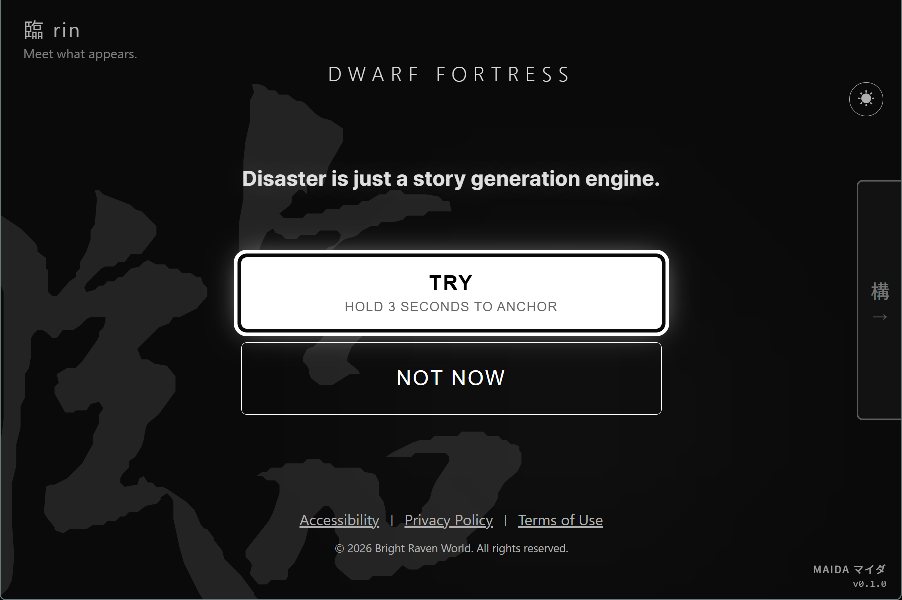
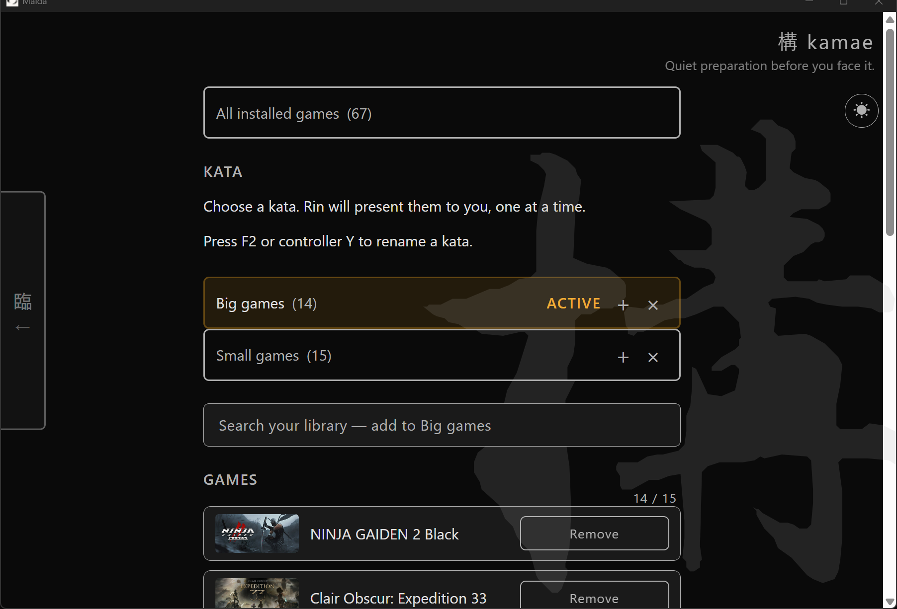

[English](README.md) | [日本語](README.ja.md) | 繁體中文 | [简体中文](README.zh-CN.md)

# Maida

**Steam 遊戲庫裡 200 款。今晚玩什麼毫無頭緒。**

Maida 一次只秀一款遊戲。玩或跳過。沒有瀏覽、沒有捲動、沒有選擇疲勞。

## 下載

**[下載 Maida](https://github.com/devBrightRaven/maida/releases/latest)** — Windows(.exe)跟 Linux(.deb、.AppImage)

> **第一次在 Windows 上安裝?** SmartScreen 會跳出警告,因為 Maida 沒有經過程式碼簽署(付費憑證每年要 300 美元以上)。點擊 **其他資訊** → **仍要執行**。原始碼公開([MIT](LICENSE)),預設不收集任何資料。完整說明見[使用手冊](https://maida.brightraven.world/manual/)的 Before You Install 段落。
>
> **使用 ROG Ally?** 請在 Armoury Crate 設為 gamepad 模式,或將 Maida 加入遊戲 profile,按鍵才會以 gamepad 訊號送入。

## 怎麼用

1. Maida 讀取你已安裝的 Steam 遊戲
2. 出現一款遊戲 — **玩看看** 或 **先跳過**
3. 按玩看看遊戲就啟動。按先跳過就出現下一款
4. 就這樣。沒清單、沒評分、沒推薦

## 功能

- **兩種模式** — Rin 快速決策,Kamae 把遊戲分類到型(以心情分組的清單)
- **從你身上學** — 每次選擇帶權重,每天衰減回中性
- **4 種語言** — 英文、日文、繁體中文、簡體中文
- **鍵盤跟手把** — 十字鍵跟左搖桿操作,右搖桿捲動長頁面,為 ROG Ally 等掌機設計
- **螢幕閱讀器支援** — Windows NVDA 測試過
- **自動更新** — 未來版本自動安裝

## 更多資訊

- **使用手冊**: [線上版(英文)](https://brightraven.world/maida/manual/) 或 [Gist 上的 4 語言版](https://gist.github.com/devBrightRaven/b26da3e8aef40d683a92e66e5b783fec)
- **隱私**: 遊戲資料全部留在你的裝置上;啟動時一次匿名 ping,可在設定關閉
- **無障礙**: 鍵盤、螢幕閱讀器(NVDA 測過、Orca 部分支援)、焦點管理、尊重 prefers-reduced-motion。完整聲明見 [brightraven.world/accessibility/](https://brightraven.world/accessibility/)
- **開發**: 安裝、測試、編譯步驟見 [DEVELOPMENT.md](DEVELOPMENT.md)
- **貢獻**: 目前不接受貢獻

## 授權

[MIT](LICENSE)

## 支持

如果 Maida 對你有用:

聯絡: bertram@brightraven.world
